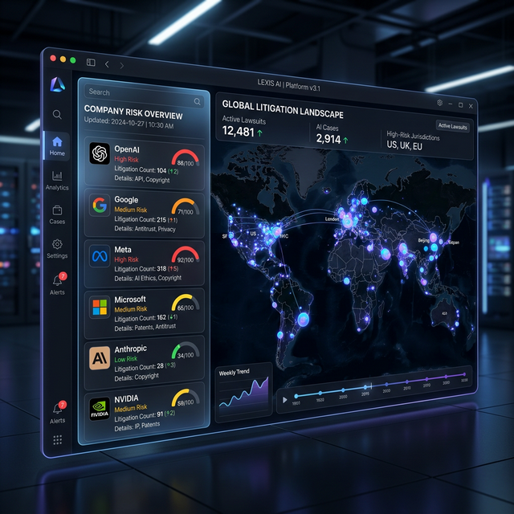
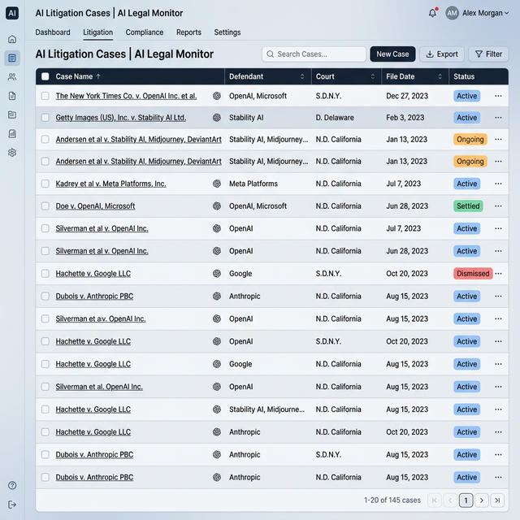

# AI Litigation Intelligence Platform (MariaDB Final Version)

A comprehensive system for tracking, processing, and visualizing litigation involving Artificial Intelligence companies. This platform automates the collection of legal dockets from CourtListener and serves them via a modern interactive dashboard, supporting both live data and historical CSV datasets.

## 🖼️ Visual Preview



*AI Litigation Intelligence Platform Dashboard*



*Interactive U.S. Map of AI Litigation*


## 🚀 Quick Start (Ubuntu 24.04)

Follow these steps to reproduce the environment and output on a fresh Ubuntu 24.04 installation.

### 1. Prerequisites
Install Docker and Git:
```bash
sudo apt update
sudo apt install -y docker.io docker-compose-v2 git
sudo usermod -aG docker $USER
# Note: You may need to restart your session for group changes to take effect.
```

### 2. Setup Directory Structure
Clone the repository and prepare the database initialization script:
```bash
git clone https://github.com/leemgs/ai-suit-visualizer-v01.git
cd ai-suit-visualizer-v01

# Ensure MariaDB can find the schema.sql file
mkdir -p docker/database
cp database/schema.sql docker/database/
```

### 3. Launch Services
Start the MariaDB database and FastAPI backend using Docker Compose:
```bash
docker-compose -f docker/docker-compose.yml up -d
```
*The services will be available at:*
- **Web Dashboard**: [http://localhost:8000](http://localhost:8007)
- **API Docs (Swagger)**: [http://localhost:8000/docs](http://localhost:8007/docs)

---

## 📊 Dashboard & Visualization

The platform features a premium web interface for visualizing AI lawsuits across the United States.

### Features:
1.  **Dataset Selection**: Choose from various archived `.csv` files in the `./data/` directory.
2.  **Temporal Filtering**: Select a specific date to view the litigation landscape at that point in time.
3.  **Interactive U.S. Map**: 
    *   Highlighting states with active lawsuits.
    *   Clicking on a state directly links to the **CourtListener** docket for detailed viewing.
4.  **Live Side Panel**: View the most recent 20 cases matching your criteria.

### Data Methods:
- **Method 1 (Live API)**: Fetches real-time data from CourtListener.
- **Method 2 (CSV)**: Reconstructs litigation history from local datasets.

---

## 🛠️ API Documentation

| Endpoint | Description | Parameters |
| :--- | :--- | :--- |
| `GET /api/cases` | Main data endpoint (Live or CSV) | `file_name` (optional) |
| `GET /api/files` | Lists available CSV files in `./data/` | None |
| `GET /api/db-cases`| Fetches cases currently stored in MariaDB | None |
| `/` | Interactive Web Dashboard | None |

---

## 🏗️ Project Architecture

| Component | Technology | Description |
| :--- | :--- | :--- |
| **Frontend** | HTML5, CSS3, JS (Vanilla) | Modern responsive dashboard with SVG map. |
| **Backend** | FastAPI (Python 3.10) | REST API serving case data and static files. |
| **Database** | MariaDB 10.6 | Persistent storage for litigation metadata. |
| **Collector** | Python Requests | Fetches data from CourtListener. |
| **Builder** | Python / Pandas | Unifies data from API/CSV for visualizer. |

---

## 📂 Project Structure
```text
.
├── backend/            # FastAPI source code
│   └── main.py         # API endpoints and static file serving
├── frontend/           # Web Dashboard interface
│   ├── index.html      # Main layout
│   ├── css/            # Style sheets (Dark mode / Glassmorphism)
│   └── js/             # Application logic & map interaction
├── collector/          # Data harvesting & processing
│   ├── main.py         # Entry point for DB ingestion
│   ├── builder.py      # Dual-mode data constructor (API/CSV)
│   ├── courtlistener.py# CourtListener API client
│   └── tracker.py      # Metadata tracking logic
├── database/           # Database schema definitions
├── docker/             # Docker Compose configuration
└── data/               # Historical datasets (.csv)
```

---

## 🛠️ Maintenance

### Database Inspection
```bash
docker compose -f docker/docker-compose.yml exec mariadb mariadb -u root -ppassword ai_lawsuits
```

### Monitoring & Logs
```bash
docker compose -f docker/docker-compose.yml logs -f
```

### Reproducing Local Output
To verify a specific date (e.g., March 10, 2026):
1. Open `http://localhost:8000` in your browser.
2. Select `aisuit_20260313.csv`.
3. Set the date picker to `2026-03-10`.
4. Click **Visualize**.
